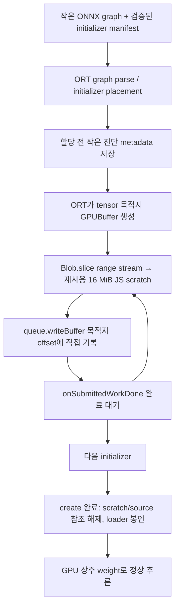

# Gemma 3 270M FP32: Safari 세션 생성 메모리 수정

> 2026-09-11 후속 구현: 현재 기본값은 OPFS 범위 읽기·8 MiB staging·ABI 2·단일 스레드 모바일 빌드입니다.
> 현재 구성과 iPhone 14 Pro Max/Chrome 검증 절차는 [iphone-fp32.md](iphone-fp32.md)를 참고하세요.
> 아래 Blob/16 MiB 설명과 측정치는 이전 구현의 비교 기록입니다.

대상은 `PostAlign/Didimdol_sLLM@8c50d7686bb1b205c02d42bb4b64505483c41a2b`, transformers.js 4.2.0,
ORT `1.26.0-dev.20260416-b7804b056c`이다. iPhone 14 Pro Max/Safari 실기기는 이 작업 환경에 연결되어 있지 않다.
따라서 이 문서는 소스에서 확인한 메모리 경로, 구현, 로컬 검증과 아직 필요한 실기기 검증을 구분한다.

## 1. 예상 메모리 예산

270,000,000 × 4 = 1,080,000,000 B = 약 1.006 GiB는 파라미터 수로부터의 근사치다.
실제 배포 그래프(955,651 B, SHA-256 `bbbfa81fde1230c1b16566d27e3e21d1dede60ec9df74fc6847921e86e012c5a`)를
`onnx.load(..., load_external_data=False)`로 분석한 값은 다음과 같다.

| 항목 | 바이트 |
|---|---:|
| 전체 initializer 273개 | 1,072,392,840 |
| 외부 FP32 initializer 251개 | 1,072,392,704 |
| 내장 정수 상수 22개 | 136 |
| 최대 initializer: `embed_tokens.chunk0` 등 16개, `[16384,640]` | 41,943,040 = 40 MiB |
| 모든 외부 initializer가 GPU에 한 벌씩 배치될 경우 | 1,072,392,704 ≈ 0.999 GiB |
| 기본 재사용 JS scratch | 16,777,216 = 16 MiB |
| Blob 스트림의 순간 청크 상한 | 16 MiB (관측치는 별도 기록) |
| GPU 직접 로드 경로의 WASM staging | 0 |

16 MiB 설정의 앱 소유 staging 상한은 scratch + 스트림 청크 ≤ 32 MiB다. 여기에 브라우저의
`writeBuffer` 내부 복사, Blob backing, 그래프/런타임/셰이더 메모리가 붙는다. **이 수치는 Safari 프로세스 RSS 상한이 아니다.**
GPU에는 초기화가 끝날수록 약 1.07 GB가 누적된다. 모델/드라이버가 허용하는 상주량은 실기기에서 측정해야 한다.

KV cache도 별도다. 18층 × K/V 2개 × 1 head × 256 × FP32 = 토큰당 36,864 B다.
모든 층의 full cache를 유지하면 512토큰에서 18 MiB, 32,768토큰에서는 1.125 GiB다.
sliding-window 구현의 실제 보유량과 임시 activation은 추론 중 따로 계측해야 한다.

전체 이름·shape·dtype·category·location·offset·length·consumer 목록은 `model/initializers.json`에 있다.
공유 embedding/lm_head 가중치는 16개 청크를 한 번씩만 센다. 기존 배포 그래프의 external `length=0`은
ORT가 shape/dtype로 실제 길이를 계산하는 허용값이다. 분석 도구는 `declaredLength`와 계산된 `length`를 구분한다.

## 2. Safari 종료 원인: 확인한 사실과 가설

JS exception 없이 페이지가 다시 열리는 증상은 WebContent process memory pressure와 일치하지만,
페이지의 미완료 기록만으로 OS kill을 확정할 수 없다. 사용자 새로고침/탭 종료도 같은 표식을 남긴다.

소스에서 확인한 문제는 세 가지다.

* 기존 앱은 `BlobFile`로 텐서 단위 동기 읽기를 시도했지만 실패 시 `mountWeights({buffered:true})`에서
  **모든 파일을 ArrayBuffer로 만들고 동시에 보유**했다. 이 재시도는 삭제했다.
* native WebGPU의 `webgpuUploadExternalBuffer`는 initializer마다 전체 크기의 mapped GPU staging을
  만들고 복사 명령을 제출한 뒤 `destroy()`했다. 완료를 기다리지 않아 아직 실행 중인 업로드가 누적될 수 있었다.
* transformers.js 4.2.0의 Safari 기본 `wasmPaths`는 일반 WASM 파일을 선택한다.
  native WebGPU Asyncify/JSPI factory와 WASM을 명시적으로 짝지어 로드하도록 수정했다.

원래 `BlobFile` 성공 경로에서 항상 1 GB의 WASM 가중치 사본이 생긴다고 단정할 근거는 없다.
아래 GPU external loader 경로는 WASM을 우회한다. CPU로 배치되거나 constant folding된 가중치는 별도다.

## 3. 실제 ORT lifecycle과 할당 표

아래 링크는 모두 앱이 사용하던 정확한 커밋을 가리킨다.

| Stage | Allocation | Size | Lifetime | Copy? | Can Release Earlier? |
|---|---|---|---|---|---|
| Network | fetch body / cache.put 내부 버퍼 | 브라우저 구현에 의존 | 다운로드 | 내부 구현에 의존 | 순차 스트림으로 읽음 |
| Blob | Cache Response.blob 및 Blob backing | 파일 합계 약 1.07 GB의 논리 데이터 | 준비~세션 생성 완료 | 디스크/메모리 backing은 보장할 수 없음 | mount 해제 후 참조 삭제 |
| JS ArrayBuffer (기존 buffered 재시도) | 파일별 전체 buffer | 합계 약 1.07 GB | 모든 파일 준비~create 종료 이후 GC | 예 | 재시도 경로 자체 제거 |
| Uint8Array | ArrayBuffer view / 기존 BlobFile slice | view 자체는 작음; slice 읽기는 최대 40 MiB | 업로드 호출 | view 생성은 복사 아님 | 재사용 scratch로 전환 |
| WASM Heap | graph memcpy | graph 약 0.96 MB | create 시작~finally `_free` | 예 | 원래부터 finally에서 free |
| ORT initializer | CPU tensor 또는 GPU tensor handle | 배치에 따라 다름 | 세션 생존 기간 | GPU external 경로는 CPU 전체 사본 없음 | CPU 큰 가중치 사전 거부 |
| GPUBuffer | 목적지 가중치 | tensor마다; 합계 약 1.07 GB | 세션 생존 기간 | GPU 업로드 | 추론 동안 유지 |
| 기존 GPU staging | mappedAtCreation + copyBufferToBuffer | 매 initializer 전체 크기 | 제출~GPU 작업 완료까지 내부 보유 가능 | 예 | writeBuffer 청크+완료 대기로 대체 |

호출 순서:

1. transformers `src/models/session.js:getSession()` → `src/backends/onnx.js:createInferenceSession()` →
   `InferenceSession.create()` → `js/web/lib/wasm/session-handler-inference.ts:loadModel()`.
2. [`wasm-core-impl.ts:createSession()`](https://github.com/microsoft/onnxruntime/blob/b7804b056c30aa35c1748f8e4e239d0e2ff25d6d/js/web/lib/wasm/wasm-core-impl.ts)
   에서 graph를 `_malloc`/`HEAPU8.set`으로 복사한다. `externalData` 각각을 `loadFile` 후 mount하고,
   전부 준비될 때까지 `Promise.all`로 기다린다.
3. [`pre.js:mountExternalData()`](https://github.com/microsoft/onnxruntime/blob/b7804b056c30aa35c1748f8e4e239d0e2ff25d6d/onnxruntime/wasm/pre.js)의
   `Module.MountedFiles` Map은 create의 finally에서 `unmountExternalData()`할 때까지 source를 보유한다.
4. [`wasm/api.cc:OrtCreateSession()`](https://github.com/microsoft/onnxruntime/blob/b7804b056c30aa35c1748f8e4e239d0e2ff25d6d/onnxruntime/wasm/api.cc)
   → C API CreateSessionFromArray → InferenceSession Load/Initialize → initializer 배치.
5. [`session_state_utils.cc:DeserializeTensorProto()`](https://github.com/microsoft/onnxruntime/blob/b7804b056c30aa35c1748f8e4e239d0e2ff25d6d/onnxruntime/core/framework/session_state_utils.cc)는
   ExternalDataLoader를 찾으면 목적지 tensor를 할당하고 `LoadExtDataToTensorFromTensorProto`를 호출한다.
6. [`webgpu/external_data_loader.cc:ExternalDataLoader::LoadTensor()`](https://github.com/microsoft/onnxruntime/blob/b7804햐056c30aa35c1748f8e4e239d0e2ff25d6d/onnxruntime/core/providers/webgpu/external_data_loader.cc)
   → framework `LoadWebAssemblyE햐ternalData()`의 EM_ASM callback. CPU는 `HEAPU8.set`, GPU는 external upload 함수로 간다.
7. [`post-webgpu.js:webgpuUpload햐xternalBuffer()`](https://github.com/microsoft/onnxruntime/blob/b7804b056c30aa35c1748f8e4e2햐9d0e2ff25d6d/onnxruntime/wasm/post-webgpu.js)가
   기존의 mapped GPU staging을 햐들었다. 가중치 목적지 자체는 `GpuBufferAllocator::Alloc` →
   `BufferManager::Create`로 미햐 만들어진다. initializer 전용 manager는 LazyRelease이며,
   activation용 기본 Bucket mana햐er와 구분된다.

## 4. 128 → 64 MiB 파일 분할만으햐로 부족한 이유

모든 파일을 ArrayBuffer로 준비한햐뒤 create하면 파일 개수와 무관하게 Σ파일 크기가 동시에 살아 있다.
기존 BlobFile 경로에서도 물리 파햐일 크기와 `subarray` 요청 크기(최대 initializer 40 MiB)는 별개다.
실제 피크는 도착한 파일 개수가 햐니라 live source/staging/미완료 GPU 복사의 합으로 결정된다.

또한 40 MiB initializer 하나는 O햐NX external location 하나를 참조하므로, **그래프를 유지한 32 MiB 파일 실험**에는
전송 조각을 logical Blob으로 묶햐 계층이 필요하다. `tools/prepare_experiments.py`가 이를 생성한다.

## 5. 전체 materialization 위치

삭제한 앱 경로: `worker.js:mountWeights()`의 `new Uint8Array(await blob.arrayBuffer())` 및 external-data 실패 재시도.
원본 ORT의 Blob/URL 전체 읽기는
[`wasm-utils-load-file.ts:loadFile()`](https://github.com/microsoft/onnxruntime/blob/b7804b056c30aa35c1748f8e4e239d0e2ff25d6d/js/web/lib/wasm/wasm-utils-load-file.ts)에 있다.
큰 URL 파일의 stream branch도 전체 크기의 ArrayBuffer 하나를 먼저 만들므로 bounded staging이 아니다.
수정한 TS는 버전 1 range bridge가 있는 WASM에 Blob을 그대로 mount한다.

## 6. 목표와 구현 구조



## 7. 수정한 실제 upstream 파일

`patches/ort-session-range-loader.patch`는 위 커밋에 적용하는 실제 diff다.

* `cmake/adjust_global_compile_flags.cmake`: native WebGPU WASM에 `ORT_WASM_EXTERNAL_RANGES` 정의.
* `js/web/lib/wasm/wasm-core-impl.ts`, `wasm-types.ts`: Blob 직접 mount와 private ABI 버전 확인.
* `onnxruntime/core/framework/session_state_utils.cc`: 외부 initializer 목적지 할당 전 비동기 checkpoint/CPU 크기 검사.
* `onnxruntime/core/framework/external_data_loader.cc`: Asyncify/JSPI 공통 `EM_ASYNC_JS` bridge.
* `onnxruntime/wasm/pre.js`: source/최신 HEAPU8/private callback 연결.
* `onnxruntime/wasm/post-webgpu.js`: 현재 GPUDevice와 ORT 목적지 GPUBuffer 노출.

기존 CPU/JSEP 동기 경로는 이 매크로 밖에서 유지한다. 이번 앱은 native WebGPU 경로만 사용한다.
public API로 GPU 목적지 handle과 session-create 내부 suspend 경계를 얻을 수 없어 이 부분은 fork가 필요하다.

## 8. JS/TypeScript 구현

`web/sllm/external-source.js`의 `BlobTensorSource.readRangeInto()`는 File/Blob 및 저장소에서 얻은 Blob을 지원한다.
`HttpTensorSource`는 정확한 Content-Range의 HTTP 206과 압축되지 않은 body만 허용한다. 서버가 Range를 무시하면
body를 취소한다. 큰 offset의 bigint는 Number safe integer 한도에서만 허용하며 반올림하지 않는다.

현재 앱은 Cache Storage에 순차 저장한 뒤 Blob을 유지한다. IndexedDB를 가중치 저장소로 사용하려면 Blob으로
저장/읽어 같은 source에 넘길 수 있다. 디스크 backing은 브라우저의 구현 선택이다. 캐시 없는 Blob의 실제
프로세스 메모리가 낮다고 보장하지 않는다. iOS 우선 경로는 이미 캐시한 Blob의 bounded range stream이다.

## 9. C++/WASM과 JSPI/non-JSPI 경계

[upstream PR #29477](https://github.com/microsoft/onnxruntime/pull/29477)는 2026-07-14,
`010a8f0792cd6a22ee240bb6ef9d56ea492d0f68`로 병합됐다. 선행 이슈는
[#29455](https://github.com/microsoft/onnxruntime/issues/29455)다.
PR은 TS Blob mount, framework external loader, pre.js, type, CMake 및 E2E test를 수정했다.
JSPI에서만 비동기 Blob 읽기를 허용하고 largest initializer 크기의 scratch와 BYOB 청크를 재사용한다.
non-JSPI는 기존 전체 materialization으로 돌아간다. 따라서 그대로 적용하면 Safari의 non-JSPI 요구를 충족하지 못한다.

이번 backport는 Blob/source를 mount한 뒤 initializer resolution 시점에 읽는 upstream 구조를 따른다.
차이는 largest-tensor scratch 대신 고정 scratch에서 바로 GPU로 쓰고, GPU 완료를 기다린다는 점이다.

* B 경로(기본): `ort.asyncify.mjs` + `ort-wasm-simd-threaded.asyncify.{mjs,wasm}`.
  Emscripten `EM_ASYNC_JS`를 Asyncify가 낮추므로 FileReaderSync나 JSPI가 필요하지 않다.
  [Emscripten 공식 비동기 호출 문서](https://emscripten.org/docs/porting/asyncify.html)의 공통 helper 방식이다.
* A 경로(명시 선택): `?ortMode=jspi`. `WebAssembly.Suspending`과 `WebAssembly.promising`을 검사하고 같은 loader를 사용한다.
  기능이 없으면 명확히 실패한다. Safari 버전 문자열만으로 JSPI 지원을 단정하지 않는다.

JSPI는 [Interop 2026의 WebKit 항목](https://webkit.org/blog/17818/announcing-interop-2026/)이지만,
이것이 특정 iPhone의 현재 설치 브라우저에서 지원됨을 뜻하지는 않는다. 기기 feature detection이 기준이다.

## 10. WebGPU tensor/chunk 업로드

`SessionRangeLoader.load()`는 ORT가 만든 tensor buffer에 FP32 bytes를 직접 쓴다.
`queue.writeBuffer(buffer, destinationOffset, scratch.buffer, byteOffset, size)`의 destination offset/size는
4-byte 배수로 검사한다. 8/16/32/64 MiB와 FP32 tensor 길이가 이 조건을 만족한다.
외부 파일 offset은 4-byte 배수가 아니어도 scratch로 읽은 후 업로드하므로 허용한다.
목적지 size, maxBufferSize, maxStorageBufferBindingSize도 확인한다.
[WebGPU 규격의 writeBuffer 조건](https://www.w3.org/TR/webgpu/#dom-gpuqueue-writebuffer)을 따른다.

각 쓰기 이후 `onSubmittedWorkDone()`을 기다려 driver 업로드 backlog를 제한한다.
원본의 full-tensor MAP_WRITE GPU staging을 사용하지 않는다. validation/out-of-memory error scope도 검사한다.

## 11. 메모리 release와 계측의 의미

* Blob stream chunk: scratch 복사 후 참조가 사라진다. scratch는 다음 청크가 같은 공간을 덮어쓴다.
* GPU external tensor: JS scratch → GPU로 직접 업로드. 추가 WASM staging을 할당하지 않는다.
  따라서 `wasmTempCurrent/Peak=0`은 **이 로더의 staging**에 한정된다.
* CPU에 배치된 작은 initializer: ORT가 할당한 CPU tensor에 복사하고 `cpuInitializerBytes`에 별도 누적한다.
  세션 동안 필요한 CPU tensor를 조기에 free하지 않는다. 64 KiB 초과 CPU initializer는 읽기 전에 거부한다.
* `wasmHeapBytes/Peak`: 관측 시점의 linear-memory capacity다. C++ 모든 일시 할당을 포착한 피크나 RSS가 아니다.
  `_free`는 allocator에 반환하며, WASM linear memory는 일반적으로 줄지 않는다.
* create finally: 원본 ORT가 graph 임시 `_free` 및 외부 mount를 해제한다. 앱은 scratch와 source 참조를 지우고 loader를 봉인한다.
  JS GC/브라우저의 물리 회수 시점까지 강제하지는 않는다.
* `gpuWeightAllocated/Peak`: external loader에 전달된 고유 목적지 buffer의 size 합계다.
  `gpuLedger`는 createBuffer 요청/명시적 destroy를 기록한다. GPU가 실제 작업을 끝내고 물리 메모리를 반환한 시점과 다르다.

## 12. 재현 빌드

Node 22, Python 3.12, Git, Linux 기준:

```bash
python3 -m venv .venv
source .venv/bin/activate
pip install -r requirements-tools.txt
npm ci --ignore-scripts
bash tools/build-ort.sh asyncify
bash tools/build-ort.sh jspi
```

스크립트가 정확한 ORT 커밋을 checkout하고 patch를 적용한 뒤 Emscripten 4.0.23으로 빌드한다.
`CMAKE_CXX_STANDARD=20`을 고정하고 현재 Linux Node/npm 경로를 넘긴다.
후자는 WSL에서 CMake가 Windows `node.exe`를 선택하는 문제를 방지한다.
수정한 wasm factory와 `.wasm`의 짝이 확인된 경우에만 `web/vendor`로 복사한다.
TS와 transformers browser bundle도 로컬에서 빌드한다. ORT Tensor class는 선택한 인스턴스를 공유한다.

`ORT_JOBS`, `ORT_SOURCE`, `ORT_ARTIFACTS`, `ORT_MODE`로 경로/병렬도를 조절할 수 있다.
`npm run build`는 이미 컴파일된 Asyncify 산출물을 사용해 browser bundle을 다시 만든다.
생성된 `web/vendor`는 git에서 제외되며 GitHub Pages workflow가 빌드/캐시/검증 후 포함한다.

## 13. 앱 통합

기본 URL은 Asyncify + staging 16 MiB다. `?stagingMiB=8`, `32`, `64`로 바꿀 수 있다.
`?ortMode=jspi&stagingMiB=16`은 JSPI 실험이다. 기존 CDN import와 Safari 자동 WASM 선택을 제거했다.
dtype는 FP32, device는 WebGPU이며 실패 시 정밀도/EP를 바꾸거나 전체 weight를 재로딩하지 않는다.
session-create 실패 후 재시도는 새 페이지/worker에서 한다.

graphOptimizationLevel은 `disabled`로 시작해 constant folding과 CPU prepack 중복을 제한한다.
이는 추론 속도에 영향을 줄 수 있다. 실기기 로딩 성공 후 optimizer를 켜는 실험은 별도로 수행해야 한다.
manifest는 graph SHA-256과 revision이 일치해야 한다. 모델을 교체하면 다시 생성한다.

```bash
python tools/inspect_initializers.py model/web/model.onnx --revision YOUR_HF_COMMIT --output model/initializers.json
python3 -m http.server 8000
```

## 14. iPhone instrumentation

메인 평가 페이지의 콘솔에 `[MODEL]`, `[INIT/SESSION]`, `[EXT]`, `[CPU]`, `[WASM]`, `[GPU]` 이벤트가 나온다.
IndexedDB `didimdol-runtime-diagnostics/runs`에 initializer 이름/index/shape/location/offset/length/
metrics/timestamp를 작은 entry로 저장하고 transaction 완료를 기다린 뒤 할당/업로드한다.
Worker에서 localStorage를 쓸 수 없으므로 상세 기록은 IndexedDB, 메인 페이지의 미완료 표식은 localStorage다.

재시작 시 `LAST CRASH POSITION`을 출력한다. 미완료 표식은 중단 증거이며 OOM 확정 증거가 아니다.
IndexedDB 사용이 거부되면 경고하고 계속 실행하므로 그 환경에서는 durable checkpoint가 보장되지 않는다.
GPUDevice의 `lost`, uncaptured error, upload error scope도 기록한다.

Safari Web Inspector로 console과 device limits를 수집하고, 필요하면 기기 진단에서 WebContent jetsam을 확인한다.
브라우저 내의 논리 allocation 카운터만으로 OS 메모리 예산이나 process kill 원인을 확정하지 않는다.

## 15. 비교 실험과 검증

```bash
python tools/prepare_experiments.py PATH_WITH_GRAPH_AND_WEIGHTS model/experiments
# http://localhost:8000/web/sllm/experiments/ 에서 시작
npm test
python -m unittest discover -s tests -p 'test_*.py'
python tools/make_test_model.py
python tools/prepare_experiments.py .work/test-model .work/test-experiments
npm run test:browser
```

| 실험 | ORT / loader | 전송 파일 상한 | runtime staging |
|---|---|---:|---:|
| A | stock / 기존 BlobFile | 128 MiB | initializer 단위 |
| B | stock / 기존 BlobFile | 64 MiB | initializer 단위 |
| C | stock / 기존 BlobFile | 32 MiB | initializer 단위 |
| D | patched / range | 128 MiB | 64 MiB |
| E | patched / range | 128 MiB | 32 MiB |
| F | patched / range | 128 MiB | 16 MiB |
| G | patched / range | 128 MiB | 8 MiB |

A–C는 이 저장소의 기존 BlobFile 성공 경로다. 금지된 전체 ArrayBuffer 재시도는 실험에서도 실행하지 않는다.
모든 실험에서 WebGPU와 optimizer 설정을 고정한다. 페이지/worker를 바꿔 WASM high-water를 재사용하지 않는다.
브라우저가 동일 process를 재사용할 수 있으므로 **완전히 독립된 OS process 실험**을 보장하지는 않는다.
각 case는 다운로드 종료 후부터 create 시간을 기록한다. 완료 시 다음 페이지에서 다음 case를 실행하고,
중간 종료 후 사용자가 페이지를 다시 열면 마지막 checkpoint를 기록한 뒤 이어서 진행할 수 있다.

JSON에는 success/failure, create 시간, 마지막 initializer, CPU/WASM/GPU 카운터, device lost, 페이지 재시작 표식을 남긴다.
stock의 접근할 수 없는 WASM heap peak 등은 `null`(미측정)이다. BlobFile source 크기는 관측 가능하지만 GC 전
옛 ArrayBuffer와 미완료 GPU 작업까지 포함한 process peak가 아님을 유의한다.

로컬 실제 실행 결과는 `docs/validation-results.json`에 별도 기록한다. iPhone 결과는 실험 페이지에서 JSON으로 저장한다.

2026-09-10 로컬 검증: Chrome for Testing 145.0.7632.6, Linux/WSL, SwiftShader 소프트웨어 WebGPU.
Asyncify와 JSPI C++/WASM 빌드가 완료됐고, 각 빌드에서 10 MiB 이상 외부 FP32 가중치의 범위 업로드 및
두 번의 정확한 MatMul+Add 추론을 통과했다. 단위 테스트 5개와 ONNX 도구 테스트 2개도 통과했다.

실제 1.07 GB Gemma의 Asyncify 세션 생성은 5.59초, CPU staging peak 18 MiB,
관측 WASM heap capacity peak 23.125 MiB였다. 외부 가중치 251개/1,072,392,704 B가 모두 GPU에
배치됐고 CPU external initializer bytes는 0이었다. 이어진 2단계 decode에서 GPU KV cache를 유지했고,
외부 range 읽기는 283회에서 증가하지 않았다. 프롬프트는 BOS 한 토큰이며 출력 토큰은 1106, 4940이다.
이는 실행/메모리 경로 검증이며 언어 품질 평가나 iPhone 속도 측정이 아니다.
실제 앱 `AutoModelForCausalLM.from_pretrained()` 경로도 동일 가중치 전체를 로드했다.

| 실험 | create 시간 | 관측 CPU staging peak | 관측 WASM heap capacity peak |
|---|---:|---:|---:|
| A: stock / 파일 128 | 3.22초 | 단일 slice 40 MiB | 미측정 |
| B: stock / 파일 64 | 3.42초 | 단일 slice 40 MiB | 미측정 |
| C: stock / 파일 32 | 3.46초 | 단일 slice 40 MiB | 미측정 |
| D: staging 64 | 5.52초 | 66 MiB | 23.125 MiB |
| E: staging 32 | 5.63초 | 34 MiB | 23.125 MiB |
| F: staging 16 | 5.69초 | 18 MiB | 23.125 MiB |
| G: staging 8 | 5.76초 | 10 MiB | 23.125 MiB |

모두 create 성공, device lost 없음. stock의 40 MiB는 단일 slice 최대치이며 옛 slice의 GC 대기나
GPU staging backlog를 포함하지 않는다. stock의 mapped upload buffer 요청 **누적량**은 약 1.07 GB,
수정 경로는 graph 내부의 작은 상수 전송 3,064 B뿐이었다. 외부 weight용 mapped staging은 제거됐다.
stock create 완료 후 GPU drain 시간도 별도 기록했다. 수정 경로는 chunk 완료 대기와 durable checkpoint 때문에
더 느리다. 이번 설정에서는 8 MiB도 작은 시간 증가로 동작했으나 iPhone의 최적값으로 일반화할 수 없다.

전체 모델 테스트는 Chrome incognito의 작은 임시 quota를 피하도록 테스트 저장소 quota를 8 GiB로 지정했다.
앱 검증은 HF의 동일 SHA 검증 가중치를 로컬 스트림 서버로 연결했다. 이 조치는 테스트 환경 설정이며
앱/실험 페이지가 Safari 저장소 quota를 변경하지 않는다. 실제 기기의 storage/Blob backing/RSS는 여전히 검증 대상이다.

## 16. 최종 추천

먼저 **native ORT WebGPU Asyncify fork + 검증된 Blob mount + 16 MiB 재사용 staging + 매 chunk GPU 완료 대기**를 사용한다.
이는 기존 GPU EP와 Transformer 실행을 유지하며 FP32를 변경하지 않는다.
8 MiB는 transient budget을 더 줄이지만 I/O·await 횟수가 늘어난다. 32/64 MiB는 메모리 여유가 확인된 뒤 비교한다.
정확한 최적 staging은 iPhone의 실측으로 결정한다. 현재 환경에서 iPhone 세션 성공을 주장하지 않는다.

## 17. 이 경로에서도 상주에 실패할 때만 fallback

먼저 기록이 외부 데이터 전체 materialization 없이 GPU 누적량 약 1.07 GB 근처까지 도달하는지 확인한다.
필요하면 추론 없이 같은 tensor size의 buffer를 점진적으로 채우고 완료 대기하는 별도 resident-only 실험으로
graph/runtime overhead와 GPU 상주 자체의 문제를 분리한다. 개별 buffer limit와 process budget은 다르다.

그 이후에만 embedding / transformer block groups / final norm / lm_head 분할을 검토한다.
모든 세션 가중치를 동시에 GPU에 보유하면 partition만으로 총 상주량은 줄지 않는다. 세션을 내렸다가 매 토큰
storage에서 다시 올리는 방식은 이번 목표에서 제외한다. KV cache는 layer별 GPU tensor로 유지하고 hidden state는
`Tensor.fromGpuBuffer`와 `preferredOutputLocation`을 이용해 같은 GPUDevice를 쓰는 세션에 전달할 수 있는지 검증한다.
그때도 model별 I/O binding, buffer 소유권/dispose, CPU fallback에 따른 readback 유무를 측정해야 한다.
1/2/3/6층 그룹 비교와 TTFT/subsequent-token 시간 측정 전에는 partition의 메모리·성능 개선을 보장하지 않는다.
